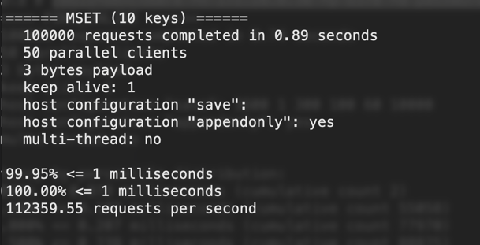

# task-sbertech-db
Кластер через docker-compose:
все сервисы поднимаются командой _redis-server_,
мастер/нода настраиваются в конфигах:
проверка что мастер работает:

Замерим производительность кластера, запустив на мастере _redis-benchmark -h 172.20.0.30 -p 6370 -a password_

Производительность одной ноды:

Видно, что одна нода обрабатывает больше сообщений, так как ей не надо поддерживать отказоустойчивость и перегонять данные по сети.