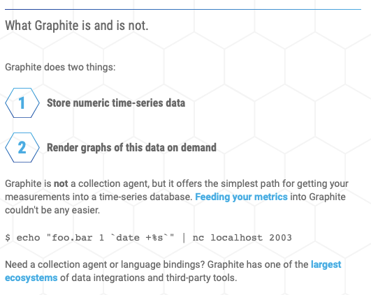

# task-sbertech-db
## Arenadata DB
CA - database:
- C - transactions

- A - master election makes availability

## DragonFly
По архитектуре реализации повторяет Redis, так что как и он, CP:

## ScyllaDB
From documentation it realises AP way:

