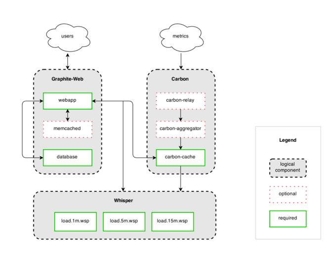
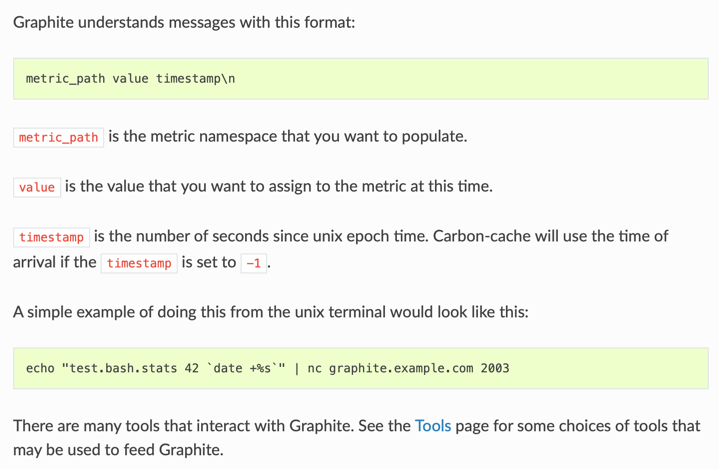

# task-sbertech-db
# Graphit
Graphite is an enterprise-ready monitoring tool that runs equally well on cheap hardware or Cloud infrastructure. Teams use Graphite to track the performance of their websites, applications, business services, and networked servers. It marked the start of a new generation of monitoring tools, making it easier than ever to store, retrieve, share, and visualize time-series data.
Graphite was originally designed and written by Chris Davis at Orbitz in 2006 as side project that ultimately grew to be their foundational monitoring tool. In 2008, Orbitz allowed Graphite to be released under the open source Apache 2.0 license. Numerous large companies have deployed Graphite to production where it helps them to monitor their production e-commerce services and plan for growth.
<br>
Graphite was initially developed by Chris Davis at Orbitz. Orbitz has long been a part of the open source community and has published several other internally developed products.
Graphite is currently developed by a team of volunteers under the Graphite-Project GitHub Organization.
### What is Graphite written in?
Python2. The Graphite webapp is built on the Django web framework and uses the ExtJS javascript GUI toolkit. The graph rendering is done using the Cairo graphics library. The backend and database are written in pure Python.
## How it works
Graphite consists of 3 software components:

- **carbon** - a Twisted daemon that listens for time-series data
- **whisper** - a simple database library for storing time-series data (similar in design to RRD)
- **graphite webapp** - A Django webapp that renders graphs on-demand using Cairo<br>
Checkout architecture diagram:

## Installation
Graphite runs on docker container, [checkout docker](https://github.com/graphite-project/docker-graphite-statsd).<br>
Command to run: `docker run -d \
--name graphite \
--restart=always \
-p 80:80 \
-p 2003-2004:2003-2004 \
-p 2023-2024:2023-2024 \
-p 8125:8125/udp \
-p 8126:8126 \
graphiteapp/graphite-statsd`
## Usage
There are three main methods for sending data to Graphite: Plaintext, Pickle, and AMQP <br>
### Plaintext
The plaintext protocol is the most straightforward protocol supported by Carbon.
The data sent must be in the following format: `<metric path> <metric value> <metric timestamp>`. Carbon will then help translate this line of text into a metric that the web interface and Whisper understand.
On Unix, the `nc` program (netcat) can be used to create a socket and send data to Carbon (by default, ‘plaintext’ runs on port 2003):<br>
```
PORT=2003
SERVER=graphite.your.org
echo "local.random.diceroll 4 `date +%s`" | nc ${SERVER} ${PORT}
```
### Pickle
The pickle protocol is a much more efficient take on the plaintext protocol, and supports sending batches of metrics to Carbon in one go.
The general idea is that the pickled data forms a list of multi-level tuples:
```markdown
[(path, (timestamp, value)), ...]
```
Once you’ve formed a list of sufficient size (don’t go too big!), and pickled it (if your client is running a more recent version of python than your server, you may need to specify the protocol) send the data over a socket to Carbon’s pickle receiver (by default, port 2004). You’ll need to pack your pickled data into a packet containing a simple header:
```markdown
payload = pickle.dumps(listOfMetricTuples, protocol=2)
header = struct.pack("!L", len(payload))
message = header + payload
```
You would then send the `message` object through a network socket.
### AMQP
When `AMQP_METRIC_NAME_IN_BODY` is set to True in your `carbon.conf` file, the data should be of the same format as the plaintext protocol, e.g. `echo “local.random.diceroll 4 date +%s”`. When `AMQP_METRIC_NAME_IN_BODY` is set to `False`, you should omit `‘local.random.diceroll’`.
#### summary

## APIs
### Cubism.js
Cubism.js is a D3 plugin for visualizing time series data in real time, and can pull data from Graphite.
### Graphitejs
Graphitejs is a jQuery plugin for easily making and displaying graphs and updating them on the fly using the Graphite URL api.
### Scales
Scales is a Python server state and statistics library that can output its data to Graphite.
### Structured Metrics
structured_metrics is a lightweight python library that uses plugins to read in Graphite’s list of metric names and convert it into a multi-dimensional tag space of clear, sanitized targets.
## The Whisper Database
Whisper is a fixed-size database, similar in design and purpose to RRD (round-robin-database). It provides fast, reliable storage of numeric data over time. Whisper allows for higher resolution (seconds per point) of recent data to degrade into lower resolutions for long-term retention of historical data.
## Render URL API
The graphite webapp provides a `/render` endpoint for generating graphs and retrieving raw data. This endpoint accepts various arguments via query string parameters. These parameters are separated by an ampersand (&) and are supplied in the format:
```markdown
&name=value
```
For example:
```markdown
# single server load on large graph
http://graphite/render?target=server.web1.load&height=800&width=600

# average load across web machines over last 12 hours
http://graphite/render?target=averageSeries(server.web*.load)&from=-12hours

# number of registered users over past day as raw json data
http://graphite/render?target=app.numUsers&format=json

# rate of new signups per minute
http://graphite/render?target=summarize(derivative(app.numUsers),"1min")&title=New_Users_Per_Minute
```
## Dashboard
You can access the Dashboard interface directly at `http://my.graphite.host/dashboard`, or via the link at the top of the Composer interface.
### Performance
Whisper is fast enough for most purposes. It is slower than RRDtool primarily as a consequence of **Whisper being written in Python**, while RRDtool is written in C. The speed difference between the two in practice is quite small as much effort was spent to optimize Whisper to be as close to RRDtool’s speed as possible. Testing has shown that **update operations take anywhere from 2 to 3 times as long as RRDtool**, and fetch operations take anywhere from 2 to 5 times as long. In practice the actual difference is **measured in hundreds of microseconds** (10^-4) which means less than a millisecond difference for simple cases.